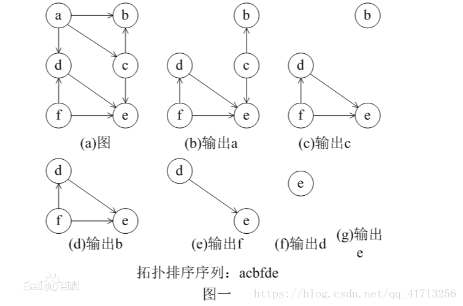
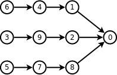

# 拓扑排序总结
在有向无环图中，可以求出一些序列。这样的原理，在实际的学习和生活中有具体的例子。对于计算机中的众多任务，也有这样的场景。一个例子，见下图：



### 简单实现的代码
```cpp
void 
int* b = new int[n];//b[]为每个点的入度
int cnt = 0;
int ans = 0;
int* vis = new int[n];// 结果集，n为节点数量
// 进行拓扑排序
for(i=1;i<=n;i++){
   for(j=1;j<=n;j++){
      if(b[j]==0){   //找到一个入度为0的点
        ans=j; // 记录开始点
        vis[cnt++]=j;// 记录到结果中
        b[j]--;// 入度变为-1
        break;
       }
    }
    for(j=1;j<=n;j++)
        if(a[ans][j]) b[j]--; //与入度为0的点相连的点的入度减一
}
    printf("%d",vis[0]);
    for(i=1;i<cnt;i++) printf(" %d",vis[i]);
    printf("\n");
```
### 用辅助队列实现
```cpp
// 开始点入队
queue<int> q;// 排序辅助队列
vector<int> edge[n];// 邻接表

for (int i = 0;i < n; ++i) {
    if (in[i] == 0) { //  in[] 每个节点的入度
        q.push(i);
    }
}
vector<int> ans; // 答案集合
// 拓扑排序
while (!q.empty()) {
    int p = q.front();q.pop()
    ans.push_back(p);
    // 对p的后继节点排序
    for (int i = 0;i < edge[p].size();++i) {
        int y = edge[p][i];
        in[y]--;
        if (in[y] == 0) {
            q.push(y);
        }
    }
}
// 结果输出
if (ans.size() == n) {
    for (int i = 0;i < ans.size();++i) {
        printf("%d",ans[i]);
    }
    printf("\n");
}
```
## 有些拓扑排序要求字典序最小什么的，那就把队列换成优先队列就好了。

## ZCMU-2153：D.ly的拍队问题
### 描述
马上要上体育课了，上体育课之前总归是要排个队的，ly作为班长，怎么排队的问题只能由她来解决，但是马上要上课了，ly又不清楚所有人的身高，她又不好意思问每个人的身高，因为这样会显的自己很不负责，于是她只能通过肉眼观察...那么问题来了，她只能观察出两个人A和B谁高谁矮，但是她没有办法排出一个序列。
ly都已经帮你出了两次主意赢过wjw，那么现在她需要你的帮助，你可以帮她吗？
(ly会告诉你A和B谁高，如果A比B高，会用A>B来表示)
### Input
只有一组数据，每个比较结果占一行，读取到文件结束

### Output
若输入数据无解，则输出"No Answer!",否则从高到低输出每个人的名字，中间没有分割符
若有多种情况，输出字典序最小的答案

#### Sample Input
E>A
A>S
S>Y
#### Sample Output
EASY

> 解析：基础的拓扑排序+priority_queue，优先队列有一个好处就是可以直接进行我们规定的规则排序。这里有一个坑，输入以EOF结束，所以我们每次输入3个字符的时候要吃掉一个换行符，可以这样写scanf("  %c%c%c  ",&a,&x,&b);在%c后面留一个空格可以吃掉回车，就是因为少吃掉一个\n wrong一发

```cpp
#include <bits/stdc++.h>
using namespace std;

const int maxn=5000+20;
int vis[maxn],vv[maxn];// 节点入度统计和节点有效标记
int ans[maxn]; // 答案结合
vector<int> v[maxn];// 图的邻接表数据结构

int main(){
    char a,b,x;
    int cnt = 0;t = 0;
    memset(vis,0,sizeof(vis));
    memset(vv,0,sizeof(vv));
    for (int i = 0;i < maxn;++i) {
        v[i].clear();
    }
    // 输入数据处理
    while(~sacaf(" %c%c%c ",&a,&b,&c)) {
        if (vv[a] == 0) {
            vv[a] = 1;// 标志a是有效值
            cnt++;
        }
        if (cc[b] == 0) {
            vv[b] = 1;// 标志b是有效值
            cnt++;
        }
        if (x == '>') {
            v[a].push_back(b);// b链在a 后面
            vis[b]++;
        } else {
            v[b].push_back(a);// a链在b 后面
            vis[a]++;
        }
    }
    // 优先队列
    priority_queue<int,vector<int>,greator<int> > q;
    while (!q.empty()) q.pop();
    for (int i = 0;i < 500;++i) {
        if (vv[i] == 1 && vis[i] == 0) { // 节点有效且节点的入度为0
            q.push(i);// 加入到可排序的队列中
        }
    }

    t = 0;
    while (!q.empty()) {
        int u = q.top();q.pop();// 取点
        ans[t++] = u;
        // 减度
        for (int i = 0;i < v[u].size();++i) {
            vis[v[u][i]]--;
            if (vis[v[u][i]] == 0) {//加入可排序列表中
                q.push(v[u][i]);
            }
        }
        // 节点数量对不上，存在环，无解
        if (t != cnt) {
            printf("No Answer!\n");
        } else {
            // 输出结果
            for (int i = 0;i < t;++i) {
                printf("%c",ans[i]);
            }
            printf("\n");
        }
    }
    return 0;
}
```

```cpp
#include <bits/stdc++.h>
using namespace std;

typedef long long LL;
const int inf = 1e9;
const int maxn = 1e6+5;
vector<int> edge[50];
int in[50];

int main() {
    char s [5];
    set<int> k;// 节点有效标志
    while(cin>>s) {
        k.insert(s[2]-'A');
        k.insert(s[0]-'A');
        if (s[1]=='>') {
            in[s[2] - 'A']++;// 入度统计
            edge[s[0] - 'A'].push_back(s[2] - 'A');
        } else {
            in[s[0]-'A']++;
            edge[s[2] - 'A'].push_back(s[0] - 'A');
        }
    }
    priority_queue<int,vector<int>,greator<int> > q;
    for (int i = 0;i < 30; ++i) {
        if (in[i] == 0 && k.count(i) != 0) {
            q.push(i);
        }
    }
    vector<int> ans;
    while (!q.empty()) {
        int p = q.top();q.pop();
        ans.push_back(p);
        for (int i = 0;i < edge[p].size();++i) {
            int y = edge[p][i];
            in[y]--;
            if (in[y] == 0 && k.count(y) != 0){
                q.push(y);
            }
        }
    }

    if (ans.size()==k.size()) {
        for (int i = 0;i < ans.size();++i) {
            printf("%c",ans[i]+'A');
        }
        printf("\n");
    } else {
        printf("No Answer!\n");
    }
    return 0;
}

///// 测试通过
/**

10 10
1 2 3 4 5 3 4 5 4 1
1 2
1 3
3 4
5 3
4 6
6 7
7 8
8 9
8 10
6 10
i = 1,t = 1
i = 5,t = 2
i = 2,t = 2
i = 3,t = 3
i = 4,t = 4
i = 6,t = 3
i = 7,t = 4
i = 8,t = 5
i = 9,t = 4
i = 10,t = 1
1 5 2 3 4 6 7 8 10 9 
*/

#include <iostream>
#include <queue>
using namespace std;

const int maxn = 2001;

class TuoPuSort{
    vector<int> edge[maxn];// 邻接表
    int in[maxn];// 入度统计

    struct task{
        int id;
        int t;
        task(){
            id = 0;
            t = 0;
        }
        task(int a,int b) {
            id = a;
            t = b;
        }
        bool operator<(const task& a) const{
            return t<a.t;
        }
    };

    struct compare{
        bool operator() (task a,task b) {
            // return a.t<b.t;//大顶锥
            return a.t > b.t;
        }
    };

    task mission[maxn];// 节点统计
    vector<int> ans;// 结集
private:
    void print(priority_queue<task> t){
        for (int i =0;i < t.size();++i){

        }
    }
public:
    void test() {
        int n,m;
        memset(mission,0,sizeof(mission));

        cin>>n>>m;
        // 输入每个任务的耗时
        for (int i = 0;i < n;++i) {
            cin>>mission[i+1].t;
        }
        // 节点依赖输入，信息统计
        int a,b,cut = 0;// cut 节点数量统计
        for (int i = 0;i < m;++i) {
            cin>> a >> b;
            if (mission[a].id == 0) {
                mission[a].id = a;
                cut++;
            }
            if (mission[b].id == 0) {
                mission[b].id = b;
                cut++;
            }
            edge[a].push_back(b);// 初始化邻接表
            in[b]++;
        }
        priority_queue<task,vector<task>,compare> q;// 排序辅助数组
        //  获取首节点
        for (int i = 1; i <= n; ++i) {
            if (in[i] == 0 && mission[i].id != 0) {
                cout<<"i = "<<i<<",t = "<<mission[i].t<<endl;
                q.push(mission[i]);
            }
        }

        while(!q.empty()) {
            task t = q.top();q.pop();
//            cout<<"i = "<<t.id<<",t = "<<t.t<<endl;
            ans.push_back(t.id);

            for (int i = 0;i < edge[t.id].size();++i) {
                int y = edge[t.id][i];
                in[y]--;
                if (in[y] == 0 && mission[y].id != 0) {
                    cout<<"i = "<<y<<",t = "<<mission[y].t<<endl;
                    q.push(mission[y]);

                }
            }
        }

        if (ans.size() == cut) {
            for (int i =0;i < ans.size(); ++i) {
                cout<<ans[i]<<" ";
            }
            cout<<endl;
        } else {
            cout<<"cut: "<<cut<<endl;
            cout<<"ans.size(): "<<ans.size()<<endl;
            cout<< "No"<<endl;
        }
    }
};
```

## 还有一种比较坑的排序 要求编号小的尽量排在前面，这里与字典序最小是不一样的，看一下例题。
## HDU-4857 拓扑排序
### Problem Description
糟糕的事情发生啦，现在大家都忙着逃命。但是逃命的通道很窄，大家只能排成一行。

现在有n个人，从1标号到n。同时有一些奇怪的约束条件，每个都形如：a必须在b之前。
同时，社会是不平等的，这些人有的穷有的富。1号最富，2号第二富，以此类推。有钱人就贿赂负责人，所以他们有一些好处。

负责人现在可以安排大家排队的顺序，由于收了好处，所以他要让1号尽量靠前，如果此时还有多种情况，就再让2号尽量靠前，如果还有多种情况，就让3号尽量靠前，以此类推。

那么你就要安排大家的顺序。我们保证一定有解。

#### Input
第一行一个整数T(1 <= T <= 5),表示测试数据的个数。
然后对于每个测试数据，第一行有两个整数n(1 <= n <= 30000)和m(1 <= m <= 100000)，分别表示人数和约束的个数。

然后m行，每行两个整数a和b，表示有一个约束a号必须在b号之前。a和b必然不同。

#### Output
对每个测试数据，输出一行排队的顺序，用空格隔开。
#### Sample Input
1   
5 10   
3 5   
1 4   
2 5   
1 2   
3 4   
1 4   
2 3   
1 5   
3 5   
1 2  

#### Sample Output
1 2 3 4 5

## 分析
举个例子如图：



如果你用优先队列拓扑排序得到的是：3 5 6 4 1 7 8 9 2 0
但是正确答案为 6 4 1 3 9 2 5 7 8 0 这样使得小的（1）尽量在前面。
这里我们可以得到 前面的小的不一定排在前面，但是有一点后面大的一定排在后面。
我们看 6和3不一定3排在前面，因为6后面连了一个更小的数字1能使得6更往前排。
在看 2和 8，8一定排在后面，因为8后面已经没有东西能使它更往前排（除了0）。
所以最后我们的做法就是 建立一个反图，跑一边字典序最大的拓扑排序，最后再把这个排序倒过来就是答案了。
```cpp
#include<iostream>
#include<cstdio>
#include<cstring>
#include<algorithm>
#include<vector>
#include<queue>
using namespace std;
typedef long long ll;

vector<int>edge[30010],ans;// 邻接表

priority_queue<int> q;
int in[30010]; // 入度统计
int T,n,m;
void init()
{
    for(int i=1;i<=n;i++)
    {
        edge[i].clear();
        in[i]=0;
    }
    while(!q.empty()) q.pop();
    ans.clear();
}
void solve()
{
    int i,j;
    for(i=1;i<=n;i++)
        if(in[i]==0) q.push(i);
    while(!q.empty())
    {
        int p=q.top(); q.pop();
        ans.push_back(p);
        for( i=0; i<edge[p].size(); i++ )
        {
            int v=edge[p][i];
            in[v]--;
            if(in[v]==0) q.push(v);
        }
    }
    for(i=ans.size()-1;i>0;i--)
        printf("%d ",ans[i]);
    printf("%d\n",ans[0]);
}
int main()
{
    int a,b;
    scanf("%d",&T);
    while(T--)
    {
        scanf("%d%d",&n,&m);
        init();
        while(m--)
        {
            scanf("%d%d",&a,&b);
            edge[b].push_back(a);
            in[a]++;
        }
        solve();
    }
    return 0;
}
```