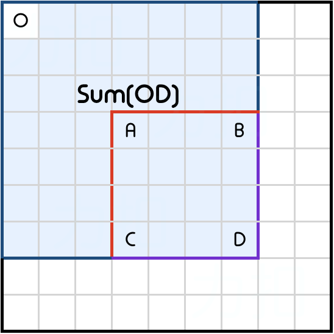
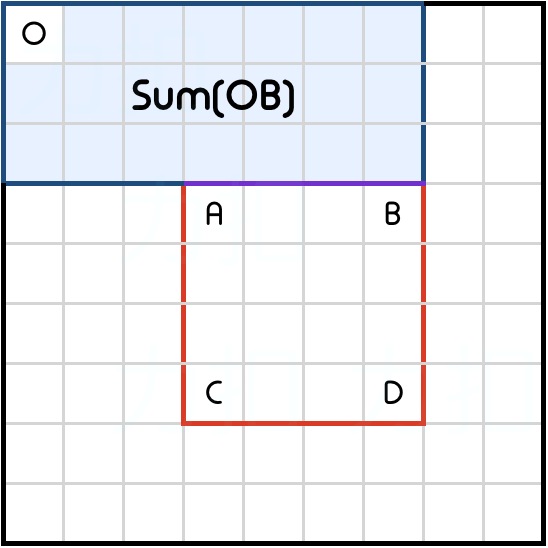
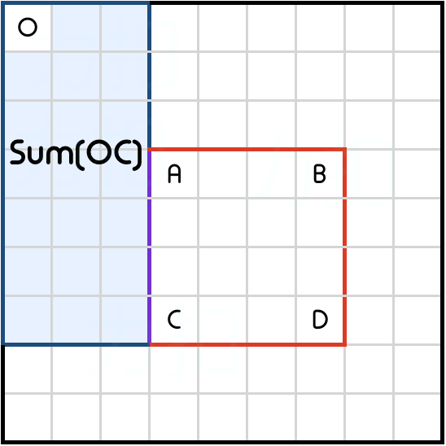
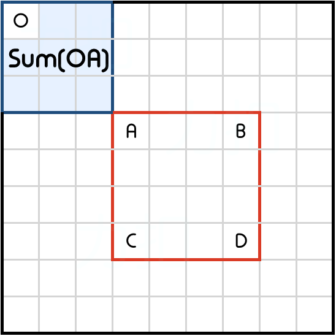

---
title: 304、二维区域和检索——数组不可变
categories:
- leetcode
tags:
  - null
date: 2020-07-26 00:19:44
---

给定一个二维矩阵，计算其子矩形范围内元素的总和，该子矩阵的左上角为 `(row1, col1)` ，右下角为 `(row2, col2)`。


上图子矩阵左上角 `(row1, col1) = (2, 1)` ，右下角(`row2, col2) = (4, 3)`，该子矩形内元素的总和为 8。

### 示例:
```
给定 matrix = [
  [3, 0, 1, 4, 2],
  [5, 6, 3, 2, 1],
  [1, 2, 0, 1, 5],
  [4, 1, 0, 1, 7],
  [1, 0, 3, 0, 5]
]

sumRegion(2, 1, 4, 3) -> 8
sumRegion(1, 1, 2, 2) -> 11
sumRegion(1, 2, 2, 4) -> 12
```
### 说明:

- 你可以假设矩阵不可变。
- 会多次调用 sumRegion 方法。
- 你可以假设 row1 ≤ row2 且 col1 ≤ col2。

<!-- 来源：力扣（LeetCode）
链接：https://leetcode-cn.com/problems/range-sum-query-2d-immutable
著作权归领扣网络所有。商业转载请联系官方授权，非商业转载请注明出处。 -->

## 题解
### 1、动态规划--前缀和子矩阵
- 缓存行
    - 将二维矩阵视为一维矩阵的m行
    - 计算每一行的前缀和，然后根据需求求出对应的子矩阵的和
```java
class NumMatrix {
    int[][] dp;
    public NumMatrix(int[][] matrix) {
        if (matrix.length == 0 || matrix[0].length == 0) return;
        dp = new int[matrix.length][matrix[0].length + 1];
        // 求每一行的前缀和
        for(int i = 0;i < matrix.length;i++) {
            for  (int j = 0;j < matrix[0].length;j++) {
                dp[i][j+1] = dp[i][j] + matrix[i][j];
            }
        }
    }
    
    public int sumRegion(int row1, int col1, int row2, int col2) {
        int res = 0;
        for (int i = row1;i <= row2;i++) {
            res += dp[i][col2+1] - dp[i][col1];
        }
        return res;
    }
}

/**
 * Your NumMatrix object will be instantiated and called as such:
 * NumMatrix obj = new NumMatrix(matrix);
 * int param_1 = obj.sumRegion(row1,col1,row2,col2);
 */
```
- 智能缓存
- 我们在一维版本中使用了累积和数组。我们注意到累积和是根据索引 0 处的原点计算的。将这个类比扩展到二维情况，我们可以预先计算出一个与原点相关的累积区域和，即 `(0,0)`。

Sum(OD)是相对于原点(0,0)的累计区域和。
如何使用预先计算的累积区域和得出 Sum(ABCD) 呢？  

Sum(OB)是矩形顶部的累积区域和。  

Sum(OC)是矩形左侧的累积区域和。  

Sum(OA) 是矩形左上角的累积区域和。  
区域 Sum(OA) 由 Sum(OB) 和 Sum(OC)两次覆盖。我们可以使用包含排除原则计算 Sum(ABCD) 如下：
$$ sum(abcd)=sum(od)−sum(ob)−sum(oc)+sum(oa)$$ 
```java
class NumMatrix {
    private int[][] dp;
    public NumMatrix(int[][] matrix) {
        if (matrix.length == 0 || matrix[0].length == 0) return;
        // 长度多1，便于数组处理和计算
        dp = new int[matrix.length + 1][matrix[0].length + 1];
        // 先求(0,0)到(i，j)的前缀子矩阵和
        for(int i = 0;i < matrix.length;i++) {
            for  (int j = 0;j < matrix[0].length;j++) {
                dp[i+1][j+1] = dp[i+1][j] + dp[i][j+1] + matrix[i][j]- dp[i][j];
            }
        }
    }
    
    // 再求(r1,c1)到(r2,c2)的子矩阵的和
    public int sumRegion(int row1, int col1, int row2, int col2) {
        return dp[row2 + 1][col2 + 1] - dp[row1][col2+1] - dp[row2+1][col1] + dp[row1][col1];
    }
}

/**
 * Your NumMatrix object will be instantiated and called as such:
 * NumMatrix obj = new NumMatrix(matrix);
 * int param_1 = obj.sumRegion(row1,col1,row2,col2);
 */
```
```