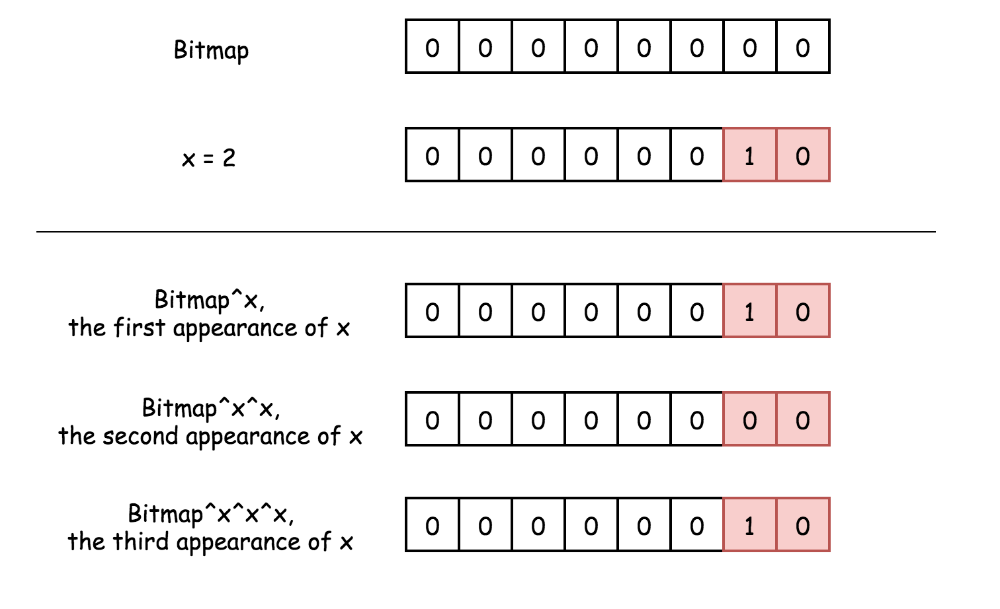

---
title: 136、137、只出现一次的数字
categories:
- leetcode
tags:
  - null
date: 2020-07-26 00:19:44
---

# 136、只出现一次的数字
给定一个非空整数数组，除了某个元素只出现一次以外，其余每个元素均出现两次。找出那个只出现了一次的元素。

**说明：**

你的算法应该具有线性时间复杂度。 你可以不使用额外空间来实现吗？

## 示例 1:
```
输入: [2,2,1]
输出: 1
示例 2:

输入: [4,1,2,1,2]
输出: 4
```
> 链接：https://leetcode-cn.com/problems/single-number

# 题解

## 1、利用异或运算的特点
异或运算：相同为0，不同为1
```Java
class Solution {
    public int singleNumber(int[] nums) {
        if (nums == null) {
            return -1;
        }
        int ans = nums[0];
        // 偶次出现的数字会被处理为0
        for(int i = 1;i < nums.length;i++) {
            ans ^= nums[i];
        }
        return ans;
    }
}
```

# 137、只出现一次的数字II
给定一个非空整数数组，除了某个元素只出现一次以外，其余每个元素均出现了三次。找出那个只出现了一次的元素。

**说明：**

你的算法应该具有线性时间复杂度。 你可以不使用额外空间来实现吗？

## 示例 1:
```
输入: [2,2,3,2]
输出: 3
示例 2:

输入: [0,1,0,1,0,1,99]
输出: 99
```

> 链接：https://leetcode-cn.com/problems/single-number-ii

## 通过HashSet
例如：`[a,a,a,b,b,b,c]`，可以按照下面的公式求解：
$$ c = (3 * (a + b + c) - (a + a + a + b + b + b + c)) / 2 $$
```java
class Solution {
    public int singleNumber(int[] nums) {
        Set<Long> set =  new HashSet<>();
        // long 类型防止int类型的溢出
        long sumSet = 0,sumArray = 0;
        for (int n : nums) {
            // 计算数组原始之和
            sumArray += n;
            // 统计数组元素
            set.add((long)n);
        }
        for (Long e : set) {
            sumSet += s;
        }
        return (int)((3 * sumSet - sumArray) / 2);
    }
}
```
## 通过HashMap
统计每个数字的个数，然后输出出现次数为1的数字

```java
class Solution {
    public int singleNumber(int[] nums) {
        HashMap<Integer,Integer> hashMap = new HashMap<>();
        for (int num : nums) {
            int pre = hashMap.getOrDefault(num, 0);
            hashMap.put(num,pre+1);
        }
        for (int k : hashMap.keySet()) {
            if (hashMap.get(k) == 1) {
                return k;
            }
        }
        return -1;
    }
}
```
## 通过位运算
$$
∼x \qquad \textrm{表示} \qquad \textrm{位运算 NOT}
$$
$$
x \& y \qquad \textrm{表示} \qquad \textrm{位运算 AND}
$$
$$
x \oplus y \qquad \textrm{表示} \qquad \textrm{位运算 XOR}
$$
### XOR
该运算符用于检测出现奇数次的位：1、3、5 等。

0 与任何数 XOR 结果为该数。
$$
0 \oplus x = x
$$


两个相同的数 XOR 结果为 0。
$$
x \oplus x = 0
$$

以此类推，只有某个位置的数字出现奇数次时，该位的掩码才不为 0。


因此，可以检测出出现一次的位和出现三次的位，但是要注意区分这两种情况。

### AND 和 NOT

为了区分出现一次的数字和出现三次的数字，使用两个位掩码：seen_once 和 seen_twice。

思路是：

- 仅当 `seen_twice` 未变时，改变 `seen_once。`

- 仅当 `seen_once` 未变时，改变 `seen_twice。`


根据上图可以知道，只有位掩码 `seen_once` 仅保留出现一次的数字，不保留出现三次的数字。

> 链接：https://leetcode-cn.com/problems/single-number-ii/solution/zhi-chu-xian-yi-ci-de-shu-zi-ii-by-leetcode/

```java
class Solution {
    public int singleNumber(int[] nums) {
        int seenOnce = 0, seenTwice = 0;

        for (int num : nums) {
            // 数字第一次出现 ：
            // 将数字与seen_once相加
            // 不需要与seen_twice相加，因为已经记录在seen_once里面了

            // 数字第二次出现
            // seen_once 归0
            // 将数字与seen_twice相加 

            // 数字第三次出现
            // 不要将数字与seen_once相加，因为已经记录在seen_twice里面了
            // seen_twice 归0
            seenOnce = ~seenTwice & (seenOnce ^ num);
            seenTwice = ~seenOnce & (seenTwice ^ num);

        }
        return seenOnce;
    }
}
```