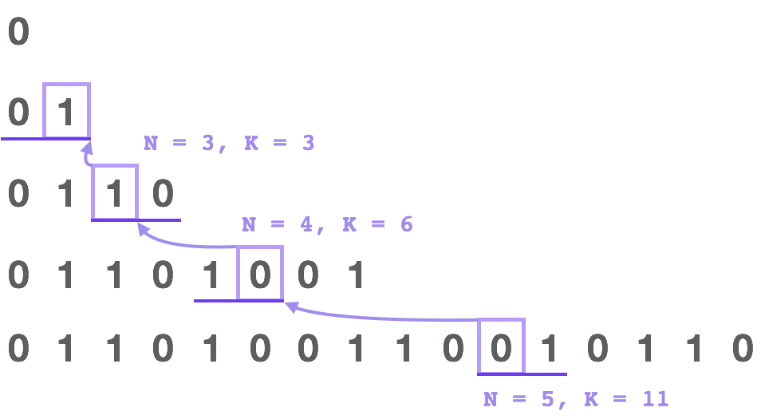

---
title: 779、第K个语法符号
categories:
- leetcode
tags:
  - null
date: 2020-07-26 00:19:44
---

# 779、第K个语法符号
在第一行我们写上一个 0。接下来的每一行，将前一行中的0替换为01，1替换为10。

给定行数 N 和序数 K，返回第 N 行中第 K个字符。（K从1开始）


例子:
```
输入: N = 1, K = 1
输出: 0

输入: N = 2, K = 1
输出: 0

输入: N = 2, K = 2
输出: 1

输入: N = 4, K = 5
输出: 1

解释:
第一行: 0
第二行: 01
第三行: 0110
第四行: 01101001
第五行: 0110100110010110
```
> 链接：https://leetcode-cn.com/problems/k-th-symbol-in-grammar

# 题解
需要找规律，相邻的解有什么特点。
前一行是后一行的前半缀，后半部分是前半缀的镜像。
## 1、暴力法
- 时间 $O(2^n)$
- 空间 $O(2^n)$
```java
class Solution {
    public int kthGrammar(int N, int K) {
        int[] lastrow = new int[1 << N];
        for (int i = 1; i < N; ++i) {
            for (int j = (1 << (i-1)) - 1; j >= 0; --j) {
                lastrow[2*j] = lastrow[j];
                lastrow[2*j+1] = 1 - lastrow[j];
            }
        }
        return lastrow[K-1];
    }
}
```
## 2、递归——父变体
因为生成每一行只需要前一行的信息，所以我们可以考虑解析前一行的位来输出答案

来看这个例子，如果我们中间有一行是 "0110"，那么就会生成 "01101001" 作为它的下一行，也就是说第一位 "0" 生成下一行中的第一个 "01"，第二位 "1" 生成下一行中的 "10"，接着 "1" 又生成了 "10"，而最后的 "0" 将会生成最后的 "01"。

一般而言，第 K 位的父位应该是第 (K+1) / 2 位。如果父位是 0，那么这一位就是 1 - (K%2)。如果父位是 1，那么这一位就是 K%2。
- 时间 $O(n)$
- 空间 $O(1)$
第K个值也存在递推关系。
```java
class Solution {
    public int kthGrammar(int N, int K) {
        if (N == 1) return 0;
        return (~K & 1) ^ kthGrammar(N-1, (K+1)/2);
    }
}
```
## 3、递推——翻转变体
就像在 方法二 中那样，我们可以尝试按它前面的位来写出这一位。

如果我们写出该序列中的几行，就可以发现：后半部分总是与前半部分相反，也就是说：'0' 变成 '1' 而 '1' 变成 '0'。

我们可以用归纳法来验证这一推断。其关键思想是，如果字符串 X 生成 Y，那么翻转后的字符串 X&#x27;将会生成 Y&#x27;
 。

这就引出了下面的算法思想：如果 K 在后半部分，那么我们可以将 K -= (1 << N-2) 设为前半部分，然后翻转得到最终答案。
- 时间 $O(n)$
- 空间 $O(1)$
```java
class Solution {
    public int kthGrammar(int N, int K) {
        if (N == 1) return 0;
        if (K <= 1 << N-2)
            return kthGrammar(N-1, K);
        return kthGrammar(N-1, K - (1 << N-2)) ^ 1;
    }
}
```

## 4、二进制计数
在 方法三 中，每一行的后半部分是前半部分反转后的结果。

当索引 K 写为二进制形式后（从 0 开始索引），后半部分的索引的第一位总是 1。

这意味着，当使用方法三中的算法时，我们翻转最终答案的**次数仅仅是 K-1 的二进制表示中的 1 的个数。**
 
- 时间 $O(log N)$
- 空间 $O(1)$
```java
class Solution {
    public int kthGrammar(int N, int K) {
        return Integer.bitCount(K - 1) % 2;
    }
}
```