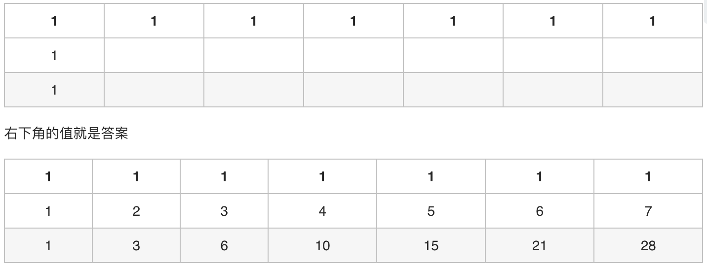
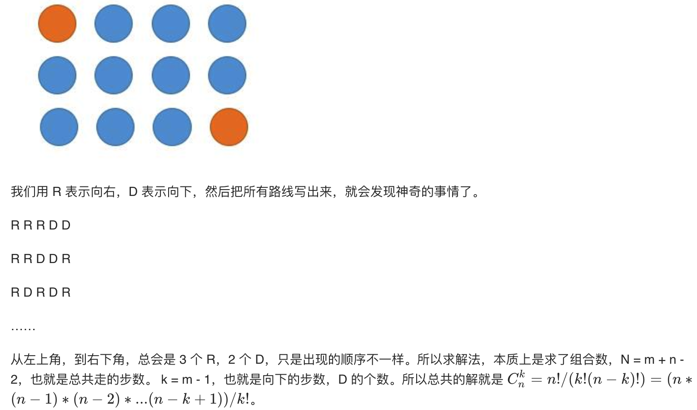

# 62、不同的路径
一个机器人位于一个 m x n 网格的左上角 （起始点在下图中标记为“Start” ）。

机器人每次只能向下或者向右移动一步。机器人试图达到网格的右下角（在下图中标记为“Finish”）。

问总共有多少条不同的路径？
例如，上图是一个7 x 3 的网格。有多少可能的路径？

> 说明：m 和 n 的值均不超过 100。

## 示例 1:
```
输入: m = 3, n = 2
输出: 3
解释:
从左上角开始，总共有 3 条路径可以到达右下角。
1. 向右 -> 向右 -> 向下
2. 向右 -> 向下 -> 向右
3. 向下 -> 向右 -> 向右
```
## 示例 2:
```
输入: m = 7, n = 3
输出: 28
```
<!-- 来源：力扣（LeetCode）
链接：https://leetcode-cn.com/problems/unique-paths
著作权归领扣网络所有。商业转载请联系官方授权，非商业转载请注明出处。 -->
# 题解
## 1 结合图形分析，寻求规律

- 规律就是依次递增可以走的路径的个数
```Java
class Solution{
    public int unquesPaths(int m,int n) {
        int[] count = new int[n];

        Arrays.fill(count,1);

        for (int i = 1;i < m;i++) {
            for (int j = 1;j < n;j++) {
                count[j] += count[j - 1];
            }
        }

        return count[n-1];
    }
}
```
## 2、递归求解
- 深度优先搜索
### 未进行优化版
```java
public int uniquePaths(int m,int n) {
    return uniquePathsCore(1,1,m,n);
}
private int uniquePathsCore(int i,int j,int m,int n) {
    if (i == m && j == n) {
        return 1;
    }
    int c = 0,w = 0;
    if (x < m) {
        c = uniquePathsCore(i + 1,j,m,n);
    }
    if (y < n) {
        w = uniquePathsCore(i,j + 1,m,n);
    }
    return c + w;
}

```
### 优化版
- 已经走过的路就标记一下
```java
public int uniquePaths(int m,int n) {
    HashMap<String,Integer> visited = new HashMap<>();
    return uniquePathsCore(1,1,m,n,visited);
}
private int uniquePathsCore(int i,int j,int m,int n,HashMap<String,Integer> visited) {
    if (i == m && j == n) {
        return 1;
    }
    int c = 0,w = 0;
    Srting key = i + 1 + "&" + j;
    if (!visited.contain(key)){
        if (i < m) {
            c = uniquePathsCore(i + 1,j,m,n,visited);
        }
    } else { c = visited.get(key);}
    
    key = i + "&" + (j+1);// java 编译器会优化字符串合并，j+1需要用()
    if (!visited.contain(key)){
        if (j < n) {
            w = uniquePathsCore(i,j + 1,m,n,visied);
        }
    } else { w = visted.get(key);}
    
    key = i + "&" + j;
    visited.put(key,c+w);

    return c + w;
}
```

## 3、动态规划
- 第一种方法就是
- `dp[i][j]`记录到(i,j)，所有可能的路径数量
```java
public int uniquePaths(int m, int n) {
        int[][] dp = new int[m+1][n+1];
        dp[1][1] = 1;
        for (int i = 1;i <= m;i++) {
            for (int j = 1;j <= n;j++) {
                if (i > 1 && j > 1) {
                    dp[i][j] = dp[i - 1][j] + dp[i][j - 1];
                } else if (i == 1 && j > 1){
                    dp[i][j] = dp[i][j - 1];
                } else if (i > 1 && j == 1) {
                    dp[i][j] = dp[i - 1][j];
                }
            }
        }
        return dp[m][n];
    }
```

### 数学分析
- 排列组合
- 分析
    - 每种情况有必有`m-1`步向右，`n-1`步向下，求这些的组合数即可。就是`m-1`个橘子，`n-1`个苹果的全排列。所有橘子都一样。所有苹果都一样。



```java
public int uniquePaths(int m, int n) {
    int N = n + m - 2; 
    int k = m - 1;  
    long res = 1; 
    for (int i = 1; i <= k; i++)
        res = res * (N - k + i) / i;
    return (int) res; 
}

// 作者：windliang
// 链接：https://leetcode-cn.com/problems/unique-paths/solution/xiang-xi-tong-su-de-si-lu-fen-xi-duo-jie-fa-by-20/
```

# 62、不同的路径II
一个机器人位于一个 m x n 网格的左上角 （起始点在下图中标记为“Start” ）。

机器人每次只能向下或者向右移动一步。机器人试图达到网格的右下角（在下图中标记为“Finish”）。

现在考虑网格中有障碍物。那么从左上角到右下角将会有多少条不同的路径？

网格中的障碍物和空位置分别用 1 和 0 来表示。

> 说明：m 和 n 的值均不超过 100。

示例 1:

## 输入:
```
[
  [0,0,0],
  [0,1,0],
  [0,0,0]
]
```
## 输出: 2
> 解释:
3x3 网格的正中间有一个障碍物。
从左上角到右下角一共有 2 条不同的路径：
1. 向右 -> 向右 -> 向下 -> 向下
2. 向下 -> 向下 -> 向右 -> 向右

# 题解
## 1、动态规划
```java
class Solution {
    public int uniquePathsWithObstacles(int[][] obstacleGrid) {
        int m = obstacleGrid.length;
        int n = obstacleGrid[0].length;
      
        int[][] dp = new int[m+1][n+1];
        dp[0][0] = 1;
        for (int i = 0;i < m;i++) {
            for (int j = 0;j < n;j++) {
                if (obstacleGrid[i][j] != 1){// 没有障碍物
                    if (i > 0 && j > 0 ) {
                        dp[i][j] = dp[i - 1][j] + dp[i][j - 1];
                    } else if (i == 0 && j > 0){
                        dp[i][j] = dp[i][j - 1];
                    } else if (i > 0 && j == 0) {
                        dp[i][j] = dp[i - 1][j];
                    }
                } else {
                    dp[i][j] = 0;// 障碍物处路径数为0
                } 
            }
        }
        return dp[m-1][n-1];
    }
}
```