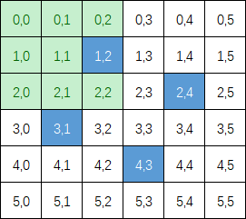

# 面试题 01.07. 旋转矩阵
给定一幅由N × N矩阵表示的图像，其中每个像素的大小为4字节，编写一种方法，将图像旋转90度。

不占用额外内存空间能否做到？

 

## 示例 1:
```
给定 matrix = 
[
  [1,2,3],
  [4,5,6],
  [7,8,9]
],

原地旋转输入矩阵，使其变为:
[
  [7,4,1],
  [8,5,2],
  [9,6,3]
]
```
## 示例 2:
```
给定 matrix =
[
  [ 5, 1, 9,11],
  [ 2, 4, 8,10],
  [13, 3, 6, 7],
  [15,14,12,16]
], 

原地旋转输入矩阵，使其变为:
[
  [15,13, 2, 5],
  [14, 3, 4, 1],
  [12, 6, 8, 9],
  [16, 7,10,11]
]
```

> 链接：https://leetcode-cn.com/problems/rotate-matrix-lcci

# 题解
## 1、总结坐标变换公式，遍历变换
参考: https://leetcode-cn.com/problems/rotate-matrix-lcci/solution/jiang-mu-biao-ju-xing-fen-ge-wei-4ge-xiao-ju-xing-/
### 变换公式
- `matrix[i][j] -> matrix[j][n - i -1]`
- `matrix[j][n - i - 1] -> matrix[n - i - 1][n - j -1]`
- `matrix[n - i - 1][n - j - 1] -> matrix[n - j - 1][i]`
- `matrix[n - j - 1][i] -> matrix[i][j]`
### 偶数阶

### 奇数阶

```java
class Solution {
    public void rotate(int[][] matrix) {
        if (matrix == null || matrix.length == 1){
            return;
        }
        int n = matrix.length;
        int row = n/2;
        // 奇数阶矩阵，需要+1
        int col = n % 2 == 0 ? n / 2: n / 2 + 1;
        for (int i = 0;i < row;i++) {
            for (int j = 0;j < col;j++) {
                int temp = matrix[i][j];
                matrix[i][j] = matrix[n - j - 1][i];
                matrix[n - j - 1][i] = matrix[n - i - 1][n - j - 1];
                matrix[n - i - 1][n - j - 1] = matrix[j][n - i - 1];
                matrix[j][n - i - 1] = temp;
            }
        }
    }
}
```
## 2、先对角线变换，再对称变换
```java
class Solution {
    public void rotate(int[][] matrix) {
        int size = matrix.length;
        // 主对角线对称变换
        for (int i = 0; i < size; i++) {
            for (int j = 0; j < size - i - 1; j++) {
                int swap = matrix[i][j];
                matrix[i][j] = matrix[size - j - 1][size - i - 1];
                matrix[size - j - 1][size - i - 1] = swap;
            }
        }
        // 纵中线对称变换
        for (int i = 0; i < size / 2; i++) {
            for (int j = 0; j < size; j++) {
                int swap = matrix[i][j];
                matrix[i][j] = matrix[size - i - 1][j];
                matrix[size - i - 1][j] = swap;
            }
        }
    }
}

```