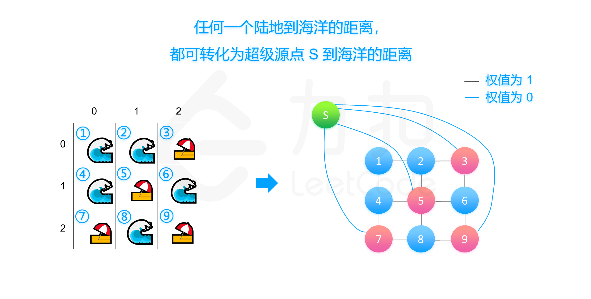

# 1162、地图分析
你现在手里有一份大小为` N x N` 的『地图』（网格） grid，上面的每个『区域』（单元格）都用 0 和 1 标记好了。其中 0 代表海洋，1 代表陆地，你知道距离**陆地区域**最远的海洋区域是是哪一个吗？**请返回该海洋区域到离它最近的所有的陆地区域的距离**。

我们这里说的距离是『曼哈顿距离』（ Manhattan Distance）：`(x0, y0)` 和 `(x1, y1)` 这两个区域之间的距离是 `|x0 - x1| + |y0 - y1|` 。

如果我们的地图上只有陆地或者海洋，请返回 -1。

## 示例 1：

```
输入：[[1,0,1],[0,0,0],[1,0,1]]
输出：2
解释： 
海洋区域 (1, 1) 和所有陆地区域之间的距离都达到最大，最大距离为 2。
```
## 示例 2：

```
输入：[[1,0,0],[0,0,0],[0,0,0]]
输出：4
解释： 
海洋区域 (2, 2) 和所有陆地区域之间的距离都达到最大，最大距离为 4。
```
**提示：**

- `1 <= grid.length == grid[0].length <= 100`
- `grid[i][j]` 不是 0 就是 1

> 链接：https://leetcode-cn.com/problems/as-far-from-land-as-possible

# 题解
图论题目。
## 1、BFS-宽度有限搜索

```Java
class Solution {
    // 位移辅助变量
    int[] dx = new int[]{-1,0,1,0};
    int[] dy = new int[]{0,1,0,-1};
    int MAX_N = 100 + 5;
    class Coordinate {
        int x;
        int y;

        int step;

        public Coordinate(int x,int y,int step) {
            this.x = x;
            this.y = y;
            this.step = step;
        }
    }

    int n;
    // 浅拷贝
    int[][] a;
    boolean[][] vis;

    private int findNearestLand(int x,int y) {
        vis = new boolean[MAX_N][MAX_N];
        Queue<Coordinate> q = new LinkedList<Coordinate>();
        q.offer(new Coordinate(x,y,0));
        vis[x][y] = true;
        while (!q.isEmpty()) {
            Coordinate f = q.peek();
            q.poll();
            for (int i = 0;i < 4;i++) {
                int nx = f.x + dx[i],ny = f.y + dy[i];
                // 遇到地图边界，直接返回
                if (!(nx >= 0 && nx <= n - 1 && ny >= 0 && ny <= n -1)) {
                    continue;
                }
                // 当前位置没有被访问过
                if (!vis[nx][ny]) {
                    q.offer(new Coordinate(nx,ny,f.step + 1));
                    vis[nx][ny] = true;
                    // 是陆地，结束。找到了最近的陆地。
                    if (a[nx][ny] == 1){
                        return f.step + 1;
                    }
                }
            }
        }
        return -1;
    }

    public int maxDistance(int[][] grid) {
        this.n = grid.length;
        a = grid;
        int ans = -1;
        for (int i = 0;i < n;i++) {
            for (int j = 0;j < n;j++) {
                if(a[i][j] == 0) {
                    ans = Math.max(ans,findNearestLand(i,j));
                }
            }
        }
        return ans;
    }
}
```
## 2、多源最短路

- Dijkstra版本
```java
class Solution {
    int MAX_N = 100 + 5;
    int INF = 1000000;
    // 位移辅助变量
    int[] dx = new int[]{-1,0,1,0};
    int[] dy = new int[]{0,1,0,-1};

    int n;
    int[][] d = new int[MAX_N][MAX_N];

    class Status implement Comparable<Integer> {
        int v,x,y;
        public Status(int v,int x,int y) {
            this.x = x;
            this.y = y;
            this.v = v;
        }

        @Override
        public int compareTo(Status s2) {
            return this.v - s2.v;
        }
    }

    Queue<Status> q =  new PriorityQueue<Status>();

    public int maxDistance(int[][] grid) {
        this.n = grid.size();
        
        // 初始化 d数组
        for (int i = 0;i < n;i++) {
            for (int j = 0;j < n;j++) {
                if (grid[i][j] == 1) {
                    d[i][j] = 0;// 陆地的距离为0
                    q.offer(new Status(0,i,j));
                } else {
                    d[i][j] = INF;// 海洋距离初始化为INF
                }
            }
        }
        // 
        while (!q.isEmpty()) {
            Status f = q.peek();
            q.poll();
            // 遍历四个方向
            for (int i = 0;i < 4;i++) {
                int nx = f.x + dx[i],ny = f.y + dy[i];
                if (!(nx >= 0 && nx <= n - 1 && ny >= 0 && ny <= n - 1)) {
                    continue;
                }
                // 新位置的权值大于应该有的权值,需要更新（nx,ny）处的权值
                if (f.v + 1 < d[nx][ny]) {
                    d[nx][ny] = f.v + 1;
                    q.offer(new Status(d[nx][ny],nx,ny));
                }
            }
        }

        // 遍历每一个海岸区域，求最大的距离（海洋与陆地）
        int ans = -1;
        for (int i = 0;i < n;i++) {
            for (int j = 0;j < n;j++) {
                if (grid[i][j] == 0) {
                    ans = Math.max(ans,d[i][j]);
                }
            }
        }

        return (ans == INF)? -1 : ans;
    }

}
```
- 多源BFS版本
```Java
class Solution {
    int MAX_N = 100 + 5;
    int INF = 1000000;
    // 位移辅助变量
    int[] dx = new int[]{-1,0,1,0};
    int[] dy = new int[]{0,1,0,-1};

    int n;
    int[][] d = new int[MAX_N][MAX_N];

    class Coordinate {
        int x, y;
        public Coordinate(int x,int y) {
            this.x = x;
            this.y = y;
        }
    };

    queue <Coordinate> q =  new LinkedList<Coordinate>();
    boolean[][] inq = new boolean[MAX_N][MAX_N];

    int maxDistance(int[][] grid) {
        this.n = grid.length;

        for (int i = 0; i < n; ++i) {
            for (int j = 0; j < n; ++j) {
                if (grid[i][j] == 1) {
                    d[i][j] = 0;
                    q.offer(new Coordinate(i, j));
                    inq[i][j] = true;
                } else {
                    d[i][j] = INF;
                }
            }
        }

        while (!q.isEmpty()) {
            Coordinate f = q.peek(); q.poll(); inq[f.x][f.y] = false;
            for (int i = 0; i < 4; ++i) {
                int nx = f.x + dx[i], ny = f.y + dy[i];
                if (!(nx >= 0 && nx <= n - 1 && ny >= 0 && ny <= n - 1)) continue;
                if (d[nx][ny] > d[f.x][f.y] + 1) {
                    d[nx][ny] = d[f.x][f.y] + 1;
                    if (!inq[nx][ny]) {
                        q.offer(new Coordinate(nx, ny));
                        inq[nx][ny] = true;
                    }
                }
            }
        }

        int ans = -1;
        for (int i = 0; i < n; ++i) {
            for (int j = 0; j < n; ++j) {
                if (grid[i][j] == 0) ans = Math.max(ans, d[i][j]);
            }
        }

        return (ans == INF) ? -1 : ans;
    }
}

// 作者：LeetCode-Solution
// 链接：https://leetcode-cn.com/problems/as-far-from-land-as-possible/solution/di-tu-fen-xi-by-leetcode-solution/
来源：力扣（LeetCode）
著作权归作者所有。商业转载请联系作者获得授权，非商业转载请注明出处。
```
## 3、动态规划
考虑优化方法二中的「把陆地区域作为源点集、海洋区域作为目标点集，求最短路」的过程。我们知道对于每个海洋区域 (x, y)(x,y)，离它最近的陆地区域到它的路径要么从上方或者左方来，要么从右方或者下方来。考虑做两次动态规划，第一次从左上到右下，第二次从右下到左上，记 f(x, y) 为 (x,y) 距离最近的陆地区域的曼哈顿距离。
- 第一阶段：从左上到右下
$$
 f(x,y)=\begin{cases}
0,& (x,y)是陆地\\
min\{f(x-1,y),f(x,y-1)\}+1, & (x,y)是海洋
\end{cases} 
$$
- 第二阶段：从右下到左上
$$
 f(x,y)=\begin{cases}
0,& (x,y)是陆地\\
min\{f(x+1,y),f(x,y+1)\}+1, &(x,y)是海洋
\end{cases} 
$$
```java
class Solution {
    int MAX_N = 100 + 5;
    int INF = 1000000;
    
    int[][] f = new int[MAX_N][MAX_N];
    int n;

    int maxDistance(int[][] grid) {
        this.n = grid.length;

        // 初始化状态数组
        for (int i = 0; i < n; ++i) {
            for (int j = 0; j < n; ++j) {
                f[i][j] = (a[i][j] == 1 ? 0 : INF);
            }
        }

        // 从左上到右下
        for (int i = 0; i < n; ++i) {
            for (int j = 0; j < n; ++j) {
                if (grid[i][j] == 1) continue;
                if (i - 1 >= 0) f[i][j] = Math.min(f[i][j], f[i - 1][j] + 1);
                if (j - 1 >= 0) f[i][j] = Math.min(f[i][j], f[i][j - 1] + 1);
            }
        }
        // 从右下到左上
        for (int i = n - 1; i >= 0; --i) {
            for (int j = n - 1; j >= 0; --j) {
                if (grid[i][j] == 1) continue;
                if (i + 1 < n) f[i][j] = Math.min(f[i][j], f[i + 1][j] + 1);
                if (j + 1 < n) f[i][j] = Math.min(f[i][j], f[i][j + 1] + 1);
            }
        }

        int ans = -1;
        for (int i = 0; i < n; ++i) {
            for (int j = 0; j < n; ++j) {
                if (grid[i][j] == 0) {
                    ans = Math.max(ans, f[i][j]);
                }
            }
        }

        if (ans == INF) return -1;
        else return ans;
    }
}

// 作者：LeetCode-Solution
// 链接：https://leetcode-cn.com/problems/as-far-from-land-as-possible/solution/di-tu-fen-xi-by-leetcode-solution/
```