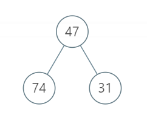
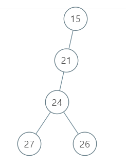
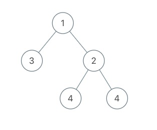

# 1、 拿硬币
> 题目难度Easy


桌上有 n 堆力扣币，每堆的数量保存在数组 coins 中。我们每次可以选择任意一堆，拿走其中的**一枚或者两枚**，求拿完所有力扣币的最少次数。

## 示例 1：
```
输入：[4,2,1]

输出：4

解释：第一堆力扣币最少需要拿 2 次，第二堆最少需要拿 1 次，第三堆最少需要拿 1 次，总共 4 次即可拿完。
```
## 示例 2：
```
输入：[2,3,10]

输出：8
```
**限制：**

- `1 <= n <= 4`
- `1 <= coins[i] <= 10`


# 题解
## 1、累加每个元素除以2的商和余数

- 代码
```java
// java
class Solution {
    public int minCount(int[] coins) {
        int res = 0;
        for (int i = 0;i<coins.length;i++) {
            res += coins[i]/2+coins[i]%2;
        }
        return res;
    }
}
```
# 2. 传递信息
> 题目难度Easy


小朋友 A 在和 ta 的小伙伴们玩传信息游戏，游戏规则如下：

有 n 名玩家，所有玩家编号分别为 0 ～ n-1，其中小朋友 A 的编号为 0
每个玩家都有固定的若干个可传信息的其他玩家（也可能没有）。传信息的关系是单向的（比如 A 可以向 B 传信息，但 B 不能向 A 传信息）。
每轮信息必须需要传递给另一个人，且信息可重复经过同一个人
给定总玩家数 n，以及按 [玩家编号,对应可传递玩家编号] 关系组成的二维数组 relation。返回信息从小 A (编号 0 ) 经过 k 轮传递到编号为 n-1 的小伙伴处的方案数；若不能到达，返回 0。

## 示例 1：
```
输入：n = 5, relation = [[0,2],[2,1],[3,4],[2,3],[1,4],[2,0],[0,4]], k = 3

输出：3

解释：信息从小 A 编号 0 处开始，经 3 轮传递，到达编号 4。共有 3 种方案，分别是 0->2->0->4， 0->2->1->4， 0->2->3->4。
```
## 示例 2：
```
输入：n = 3, relation = [[0,2],[2,1]], k = 2

输出：0

解释：信息不能从小 A 处经过 2 轮传递到编号 2
```
**限制：**

- `2 <= n <= 10`
- `1 <= k <= 5`
- `1 <= relation.length <= 90, 且 relation[i].length == 2`
- `0 <= relation[i][0],relation[i][1] < n 且 relation[i][0] != relation[i][1]`
# 题解
## 1、图论，深度优先搜索与广度优先搜索

- 深度优先搜索
```java
class Solution {
    int count;
    
    public int numWays(int n, int[][] relation, int k) {
        count = 0;
        // 邻接表
        Map<Integer,List<Integer>> map = new HashMap<>();
        // 初始化邻接表
        for(int[] re : relation) {
            if(map.containsKey(re[0])){
                map.get(re[0]).add(re[1]);
            }else{
                List<Integer> list = new ArrayList<>();
                list.add(re[1]);
                map.put(re[0],list);
            }
        }
        // 深度优先搜索递归实现
        dfs(map,0,k,n);
        return count;
    }
    // 深度优先搜索递归实现
    private void dfs(Map<Integer,List<Integer>> map,int next,int k,int n){
        // 到达目标位置 且 只使用了k步
        if (next == n - 1 && k == 0){
            count++;
            return;
        }
        // 超过了k步
        if (k < 0){
            return;
        }
        // 递归调用
        List<Integer> list = map.get(next);
        // 该位置无法传递
        if (list != null) {
            for(int a : list) {
                dfs(map,a,k-1,n);
            }
        }
    }
}
```
- 广度优先搜索
```java
class Solution {
    public int numWays(int n, int[][] relation, int k) {
        // 该需要一个变量统计总次数是否为k
        // 是返回值错了，而不是超时，考虑一些特殊情况
        // 现将relation数组按第一个元素从小到大排序
        Arrays.sort(relation, (v1, v2) -> v1[0] - v2[0]);  // 第一项为0的项都在最前面
        int res = 0;  // 返回值 方案数
        int N = relation.length;
        int depth = 0;
        int len = 0;
        Queue<int[]> queue = new LinkedList<int[]>();
        for(int i = 0; i < N; i++) {
            if(relation[i][0] == 0) {
                len++;
            }
        }
        // 传递信息只从编号0开始，不是从每一个节点开始
        for(int i = 0; i < len; i++) {  // 逐个元素进行广搜？肯定有重复
            // queue.clear();  // 清空queue 防止上一轮遍历结尾元素的干扰
            queue.clear();
            depth = 0;  // depth没更新，所以后面的元素进不来
            queue.offer(relation[i]);  // 从0开始逐个元素搜索
            while(!queue.isEmpty()) {  // 最终肯定是要把所有入队元素都poll出去的 为空就代表广度遍历完成
                int size = queue.size();  // 当前层元素总数
                depth++;  // 有一层元素就加1，所以先加加
                if(depth > k) {  // 如果此时遍历层数大于k了，后面肯定都没机会了
                    break;  // 但是queue中此时可能还有没出队的元素，在下一轮循环之前需要清空queue
                }
                for(int j = 0; j < size; j++) {  // 每次poll出的个数为当前size数，poll完push的在下一层计算
                    int[] temp = queue.poll();
                    int cur = temp[0];
                    int next = temp[1];
                    if(depth == k && next == n - 1) {  // 如果为第k层且next等于n-1
                        res++;  // 返回值+1
                    }
                    // 决定下一层数组中谁入队
                    for(int l = 0; l < N; l++) {  // 可能可以从后往前连起来？depth超过k还找不到就直接跳出了
                        if(relation[l][0] == next) {  // 如果首元素和next相等
                            queue.offer(relation[l]);
                        }
                    }
                } 
            }            
        }
        return res;
    }
}

// 作者：Yokka
// 链接：https://leetcode-cn.com/problems/chuan-di-xin-xi/solution/java-bfs-by-yokka/

```
## 3、离散数学，计算可达矩阵
计算可达矩阵，也就是邻接矩阵的k次幂，用快速幂做矩阵快速幂，然后mat[0][n-1]就是长度为k的路径条数。
```c++
typedef long long ll;
// 方式数值溢出
const ll mod = 1e9+7;
// 矩阵数据结构
struct node {
	ll mat[15][15];//定义矩阵 
}x,y;
int len;
node mul(node x,node y){//矩阵乘法 
	node tmp;
	for(int i=0;i<len;i++){
		for(int j=0;j<len;j++){
			tmp.mat [i][j]=0;
			for(int k=0;k<len;k++){
				tmp.mat [i][j]+=(x.mat [i][k]*y.mat [k][j])%mod;
			}
			tmp.mat [i][j]=tmp.mat[i][j]%mod;
		}
	}
	return tmp;
}
node matpow(node x,node y,int num){//矩阵快速幂 
	while(num){
		if(num&1){
			y=mul(y,x);
		}
		x=mul(x,x);
		num=num>>1;
	}
	return y;
}
class Solution {
public:
    int numWays(int n, vector<vector<int>>& relation, int k) {
        node x,res;
        len = n;
        memset(x.mat,0,sizeof(x.mat));
        for(auto& e:relation){
            x.mat[e[0]][e[1]] = 1;
        }
        res = matpow(x,x,k-1);
        return res.mat[0][n-1];
    }
};

// 作者：sinclairwang
// 链接：https://leetcode-cn.com/problems/chuan-di-xin-xi/solution/chi-san-shu-xue-ji-suan-ke-da-ju-zhen-by-sinclairw/
```
## 2、动态规划
状态解释：
`dp[i][j]`表示第i轮传递信息，到达j的总方案数量。
```java
class Solution {
    
    public int numWays(int n, int[][] relation, int k) {
        int[][] dp = new int[6][10];
        // 初始值,表示第0轮到达0只有一种方案
        dp[0][0] = 1;
        for(int i = 0;i < k;i++) {
            for (int[] r : relation) {
                dp[i+1][r[1]] += dp[i][r[0]];
            }
        }
        return dp[k][n-1];
    }
    
}
```
# 3、 剧情触发时间
> 题目难度Medium

在战略游戏中，玩家往往需要发展自己的势力来触发各种新的剧情。一个势力的主要属性有三种，分别是文明等级（C），资源储备（R）以及人口数量（H）。在游戏开始时（第 0 天），三种属性的值均为 0。

随着游戏进程的进行，每一天玩家的三种属性都会对应增加，我们用一个二维数组 increase 来表示每天的增加情况。这个二维数组的每个元素是一个长度为 3 的一维数组，例如 [[1,2,1],[3,4,2]] 表示第一天三种属性分别增加 1,2,1 而第二天分别增加 3,4,2。

所有剧情的触发条件也用一个二维数组 requirements 表示。这个二维数组的每个元素是一个长度为 3 的一维数组，对于某个剧情的触发条件 c[i], r[i], h[i]，**如果当前 C >= c[i] 且 R >= r[i] 且 H >= h[i] **，则剧情会被触发。

根据所给信息，请计算每个剧情的触发时间，并以一个数组返回。如果某个剧情不会被触发，则该剧情对应的触发时间为 -1 。

## 示例 1：
```
输入： increase = [[2,8,4],[2,5,0],[10,9,8]] requirements = [[2,11,3],[15,10,7],[9,17,12],[8,1,14]]

输出: [2,-1,3,-1]

解释：

初始时，C = 0，R = 0，H = 0

第 1 天，C = 2，R = 8，H = 4

第 2 天，C = 4，R = 13，H = 4，此时触发剧情 0

第 3 天，C = 14，R = 22，H = 12，此时触发剧情 2

剧情 1 和 3 无法触发。
```
## 示例 2：
```
输入： increase = [[0,4,5],[4,8,8],[8,6,1],[10,10,0]] requirements = [[12,11,16],[20,2,6],[9,2,6],[10,18,3],[8,14,9]]

输出: [-1,4,3,3,3]
```
## 示例 3：
```
输入： increase = [[1,1,1]] requirements = [[0,0,0]]

输出: [0]
```
**限制：**

- `1 <= increase.length <= 10000`
- `1 <= requirements.length <= 100000`
- `0 <= increase[i] <= 10`
- `0 <= requirements[i] <= 100000`

## 1、排序+筛选

- 代码
```java
class Solution {
    class Plot implements Comparable<Plot>{
        int type;
        int index;
        int[] condition;
        public Plot(int type,int index,int[] condition) {
            this.type = type;
            this.index = index;
            this.condition = condition;
        }
        
        @Override
        public int compareTo(Plot b){
            // 从小到大排列
            if (condition[0] >= b.condition[0]){
                return 1;
            }
            return -1;
        }
        
        // @Override
        // public String toString(){
        //     return "type: "+type+", index: "+index+", C = "+condition[0]+", R = "+condition[1]+", H = "+condition[2];
        // }
    }
    public int[] getTriggerTime(int[][] increase, int[][] requirements) {
        List<Plot> plotList = new ArrayList<>();
        int i = 0;
        int[] count = new int[3];
        plotList.add(new Plot(1,i++,Arrays.copyOf(count,3)));
        for (int[] in : increase) {
            count[0] += in[0];
            count[1] += in[1];
            count[2] += in[2];
            plotList.add(new Plot(1,i++,Arrays.copyOf(count,3)));
        }
        i = 0;
        for (int[] re : requirements) {
            plotList.add(new Plot(2,i++,Arrays.copyOf(re,3)));
        }
        Collections.sort(plotList);
        // for(Plot p:plotList) {
        //     System.out.println(p);
        // }
        int[] res = new int[requirements.length];
        for (int j = 0;j < requirements.length;j++) {
            res[j] = -1;
        }
        List<Plot> tmp = new ArrayList<>();
        for (Plot plot : plotList) {
            if (plot.type == 1){
                for (Plot p : tmp){
                    if(plot.condition[0] >= p.condition[0] && plot.condition[1] >= p.condition[1] && plot.condition[2] >= p.condition[2]) {
                        res[p.index] = plot.index;
                    }
                }
                tmp.clear();
            } else {
                tmp.add(plot);
            }
        }
        return res;
    }
}
```
## 2、二分查找
对于每一个情节，查找其是否可以触发以及触发的时机
```java
class Solution {
    public int[] getTriggerTime(int[][] increase, int[][] requirements) {
        int day = 0;
        int[] ans = new int[requirements.length];
        //将increase中的三元组的含义变为每一天的属性值
        for(int i = 1;i<increase.length;i++){
            increase[i][0] += increase[i-1][0];
            increase[i][1] += increase[i-1][1];
            increase[i][2] += increase[i-1][2];
        }
        for(int i = 0;i<requirements.length;i++){
            if(requirements[i][0]==0&&requirements[i][1]==0&&requirements[i][2]==0) ans[i] = 0;
            else{
                int left = 0;
                int right = increase.length-1;
                //如果最后一天仍不满足，设为-1
                if(!(increase[right][0]>=requirements[i][0]&&increase[right][1]>=requirements[i][1]&&increase[right][2]>=requirements[i][2])){
                    ans[i] = -1;
                    continue;
                }
                //二分查找
                while(left <right){
                    int mid = (left+right)/2;
                    if(!(increase[mid][0]>=requirements[i][0]&&increase[mid][1]>=requirements[i][1]&&increase[mid][2]>=requirements[i][2])){
                        left = mid+1;
                    }else{
                        right = mid;
                    }
                }
                ans[i] = left+1;
            }
        }
        return ans;
    }
}

// 作者：Codeband
// 链接：https://leetcode-cn.com/problems/ju-qing-hong-fa-shi-jian/solution/javaer-fen-cha-zhao-by-codeband/
```
# 4、最小跳跃次数

> 题目难度Hard

为了给刷题的同学一些奖励，力扣团队引入了一个弹簧游戏机。游戏机由 N 个特殊弹簧排成一排，编号为 0 到 N-1。初始有一个小球在编号 0 的弹簧处。若小球在编号为 i 的弹簧处，通过按动弹簧，可以选择把小球向右弹射 jump[i] 的距离，或者向左弹射到任意左侧弹簧的位置。也就是说，在编号为 i 弹簧处按动弹簧，小球可以弹向 0 到 i-1 中任意弹簧或者 i+jump[i] 的弹簧（若 i+jump[i]>=N ，则表示小球弹出了机器）。小球位于编号 0 处的弹簧时不能再向左弹。

为了获得奖励，你需要将小球弹出机器。请求出最少需要按动多少次弹簧，可以将小球从编号 0 弹簧弹出整个机器，即向右越过编号 N-1 的弹簧。

## 示例 1：
```
输入：jump = [2, 5, 1, 1, 1, 1]

输出：3

解释：小 Z 最少需要按动 3 次弹簧，小球依次到达的顺序为 0 -> 2 -> 1 -> 6，最终小球弹出了机器。
```
**限制：**

- `1 <= jump.length <= 10^6`
- `1 <= jump[i] <= 10000`

# 题解
## 1、动态规划-自顶向下
`dp[i]`表示到达从n-1出到达出所需的步数。
```java
class Solution {
    public int minJump(int[] jump) {
        int[] dp = new int[jump.length];

        dp[jump.length-1] = 1;
        for(int i=jump.length-2;i>=0;i--){
            dp[i] = jump[i]+i >= jump.length?1:dp[jump[i]+i]+1;
            //更新了，当前位置后可以影响的右边的dp值，如果后续位置的dp值大于当前位置才需要更新。
            for(int j = i+1; j < dp.length && dp[j] > dp[i]; j++){
                dp[j] = Math.min(dp[i]+1,dp[j]);
            }
        }
        //System.out.println(Arrays.toString(dp));
        return dp[0];
    }
}

// 作者：dongyangliu
// 链接：https://leetcode-cn.com/problems/zui-xiao-tiao-yue-ci-shu/solution/jian-dan-yi-dong-de-dong-tai-gui-hua-wan-fa-by-don/

```

# 5、 二叉树任务调度
通过的用户数80
尝试过的用户数204
用户总通过次数83
用户总提交次数322
题目难度Hard
任务调度优化是计算机性能优化的关键任务之一。在任务众多时，不同的调度策略可能会得到不同的总体执行时间，因此寻求一个最优的调度方案是非常有必要的。

通常任务之间是存在依赖关系的，即对于某个任务，你需要先完成他的前导任务（如果非空），才能开始执行该任务。我们保证任务的依赖关系是一棵二叉树，其中 root 为根任务，root.left 和 root.right 为他的两个前导任务（可能为空），root.val 为其自身的执行时间。

**在一个 CPU 核执行某个任务时，我们可以在任何时刻暂停当前任务的执行，并保留当前执行进度。在下次继续执行该任务时，会从之前停留的进度开始继续执行。暂停的时间可以不是整数。**

现在，系统有两个 CPU 核，即我们可以同时执行两个任务，但是**同一个任务不能同时在两个核上执行**。给定这颗任务树，请求出所有任务执行完毕的最小时间。

## 示例 1：

```
输入：root = [47, 74, 31]

输出：121

解释：根节点的左右节点可以并行执行31分钟，剩下的43+47分钟只能串行执行，因此总体执行时间是121分钟。
```
## 示例 2：

```
输入：root = [15, 21, null, 24, null, 27, 26]

输出：87
```
## 示例 3：

```
输入：root = [1,3,2,null,null,4,4]

输出：7.5
```
**限制：**

- `1 <= 节点数量 <= 1000`
- `1 <= 单节点执行时间 <= 1000`
  
# 题解
## 1、后序遍历
```java
/**
 * Definition for a binary tree node.
 * public class TreeNode {
 *     int val;
 *     TreeNode left;
 *     TreeNode right;
 *     TreeNode(int x) { val = x; }
 * }
 */
class Solution {
    /**
     * LCP 10. 二叉树任务调度
     * @param root
     * @return
     */
    public double minimalExecTime(TreeNode root) {
        double[] res = execTime(root,2);
        return res[0];
    }

    /**
     * 获取node最小执行时间
     * @param node node
     * @param n 并行数
     * @return [0]执行完当前节点最小耗时，[1]当前node为根的时间串行之和
     */
    private double[] execTime(TreeNode node,int n){
        if (node == null){
            // [0]执行完当前节点最小耗时，[1]当前node为根的时间串行之和
            return new double[]{0.0D,0.0D};
        }
        // 获取左右子树的值
        double[] leftTime = execTime(node.left,n);
        double[] rightTime = execTime(node.right,n);
        // 左右子树节点之和
        double sum = leftTime[1] + rightTime[1];
        // 当前节点执行完的最小消耗时间
        double minTime = Math.max(Math.max(leftTime[0],rightTime[0]),sum/n) + node.val;
        return new double[]{minTime,sum + node.val};
    }
}

// 作者：burning-summer
// 链接：https://leetcode-cn.com/problems/er-cha-shu-ren-wu-diao-du/solution/hou-xu-bian-li-di-gui-fan-hui-zuo-you-zi-shu-zui-y/
```