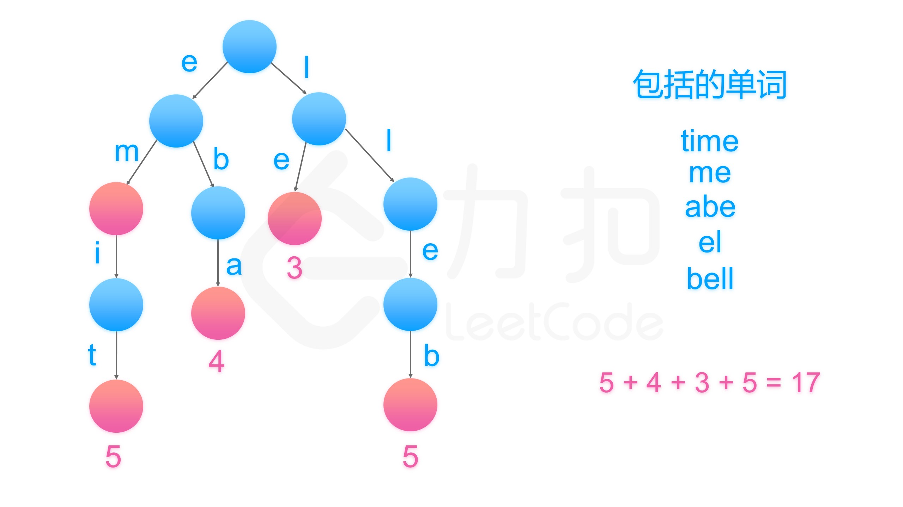

# 820、单词的压缩编码
给定一个单词列表，我们将这个列表编码成一个索引字符串 S 与一个索引列表 A。

例如，如果这个列表是 `["time", "me", "bell"]`，我们就可以将其表示为 `S = "time#bell#"` 和 `indexes = [0, 2, 5]`。

对于每一个索引，我们可以通过从字符串 S 中索引的位置开始读取字符串，直到 "#" 结束，来恢复我们之前的单词列表。

那么成功对给定单词列表进行编码的最小字符串长度是多少呢？

## 示例：
```
输入: words = ["time", "me", "bell"]
输出: 10
说明: S = "time#bell#" ， indexes = [0, 2, 5] 。
 ```

**提示：**

- `1 <= words.length <= 2000`
- `1 <= words[i].length <= 7`
- 每个单词都是小写字母 。

> 链接：https://leetcode-cn.com/problems/short-encoding-of-words

# 题解
## 1、排序+查找后缀串
- 可以返回一个满足结果的串
- 可以返回每个字符串的开始索引
```Java
class Solution {
    public int minimumLengthEncoding(String[] words) {
        Arrays.sort(words,new Comparator<String>(){
            public int compare(String s1,String s2){
                return s2.length() - s1.length();
            }
        });
        // 或者
        //  Arrays.sort(words, (s1, s2) -> s2.length() - s1.length());
        StringBuilder sb = new StringBuilder();
        // int[] indexTable = new int[words.length];
        for (int i = 0;i < words.length;i++) {
            // 第一个字符串
            if (i == 0) {
                sb.append(words[i]).append("#");
                // indexTable[i] = 0;
            } else { // 不是第一个
                // 是否包含已有的字符，该字符必须为某个单词的后缀
                int index0 = findSupString(words,i);
                if (index0 != -1){
                    int index = sb.toString().indexOf(words[index0]);
                    // indexTable[i] = index + words[index0].length() - words[i].length();
                }else{
                    // indexTable[i] = sb.length();
                    sb.append(words[i]).append("#");
                }
            }
        }
        return sb.length();
    }

    private int findSupString(String[] words,int end){
        int index = -1;
        for (int i = 0;i < end;i++){
            // 第i个单词的后缀值words[end]单词
            if (words[i].endsWith(words[end])){
                index = i;
                break;
            }
        }
        return index;
    }
}
```
## 2、直接求最短的长度
去除后缀字符串、将剩下的字符串拼接起来。
```Java
class Solution {
    public int minimumLengthEncoding(String[] words) {
        Set<String> good = new HashSet(Arrays.asList(words));
        for (String word: words) {
            for (int k = 1; k < word.length(); ++k)
                good.remove(word.substring(k));
        }

        int ans = 0;
        for (String word: good)
            ans += word.length() + 1;
        return ans;
    }
}

// 作者：LeetCode-Solution
// 链接：https://leetcode-cn.com/problems/short-encoding-of-words/solution/dan-ci-de-ya-suo-bian-ma-by-leetcode-solution/
```
## 3、字典树存储单词
字典树存储单词，可以很方便的查找后缀。


```java
class Solution {
    public int minimumLengthEncoding(String[] words) {
        TrieNode trie = new TrieNode();
        Map<TrieNode, Integer> nodes = new HashMap();

        for (int i = 0; i < words.length; ++i) {
            String word = words[i];
            TrieNode cur = trie;
            // 查找当前字符串的首字母的位置
            for (int j = word.length() - 1; j >= 0; --j)
                cur = cur.get(word.charAt(j));
            nodes.put(cur, i);
        }
        // 拼接结果
        int ans = 0;
        for (TrieNode node: nodes.keySet()) {
            if (node.count == 0)
                ans += words[nodes.get(node)].length() + 1;
        }
        return ans;

    }
}

// 字典树节点，26叉树
class TrieNode {
    TrieNode[] children;
    int count;
    TrieNode() {
        children = new TrieNode[26];
        count = 0;
    }
    public TrieNode get(char c) {
        if (children[c - 'a'] == null) {
            children[c - 'a'] = new TrieNode();
            count++;
        }
        return children[c - 'a'];
    }
}

// 作者：LeetCode-Solution
// 链接：https://leetcode-cn.com/problems/short-encoding-of-words/solution/dan-ci-de-ya-suo-bian-ma-by-leetcode-solution/

```
字典树，插入时处理
```java
class Solution {
    public int minimumLengthEncoding(String[] words) {
        int len = 0;
        Trie trie = new Trie();
        // 先对单词列表根据单词长度由长到短排序
        Arrays.sort(words, (s1, s2) -> s2.length() - s1.length());
        // 单词插入trie，返回该单词增加的编码长度
        for (String word: words) {
            len += trie.insert(word);
        }
        return len;
    }
}

// 定义tire
class Trie {
    
    TrieNode root;
    
    public Trie() {
        root = new TrieNode();
    }

    public int insert(String word) {
        TrieNode cur = root;
        boolean isNew = false;
        // 倒着插入单词
        for (int i = word.length() - 1; i >= 0; i--) {
            int c = word.charAt(i) - 'a';
            if (cur.children[c] == null) {
                isNew = true; // 是新单词
                cur.children[c] = new TrieNode();
            }
            cur = cur.children[c];
        }
        // 如果是新单词的话编码长度增加新单词的长度+1，否则不变。
        return isNew? word.length() + 1: 0;
    }
}

class TrieNode {
    char val;
    TrieNode[] children = new TrieNode[26];

    public TrieNode() {}
}

// 作者：sweetiee
// 链接：https://leetcode-cn.com/problems/short-encoding-of-words/solution/99-java-trie-tu-xie-gong-lue-bao-jiao-bao-hui-by-s/
```