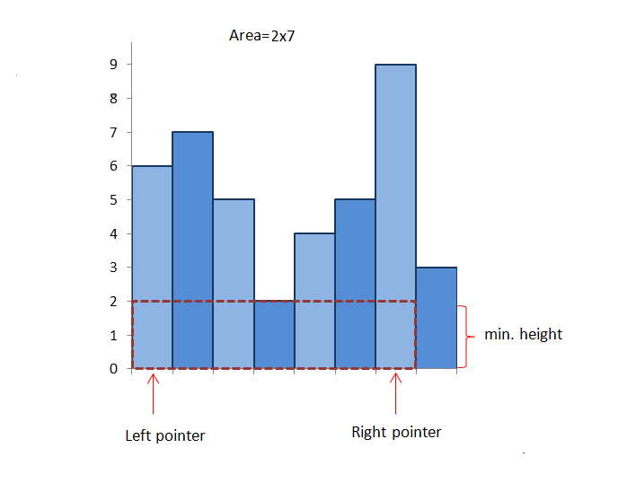

# 84、求最大的矩阵面积
给定 n 个非负整数，用来表示柱状图中各个柱子的高度。每个柱子彼此相邻，且宽度为 1 。

求在该柱状图中，能够勾勒出来的矩形的最大面积。

  
以上是柱状图的示例，其中每个柱子的宽度为 1，给定的高度为 [2,1,5,6,2,3]。  

   

图中阴影部分为所能勾勒出的最大矩形面积，其面积为 10 个单位。

# 题解

## 1、暴力

两个柱子间矩形的高由它们之间最矮的柱子决定，因此，我们可以考虑所有两两柱子之间形成的矩形面积，该矩形的高为它们之间最矮柱子的高度，宽为它们之间的距离，这样可以找到所要求的最大面积的矩形。

```java
public class Solution {
   public int largestRectangleArea(int[] heights) {
       int maxarea = 0;
       for (int i = 0; i < heights.length; i++) {
           for (int j = i; j < heights.length; j++) {
               int minheight = Integer.MAX_VALUE;
               // 求[i,j]之间的最矮的高
               for (int k = i; k <= j; k++) {
                   minheight = Math.min(minheight, heights[k]);
               }
                // 更新最大的面积
               maxarea = Math.max(maxarea, minheight * (j - i + 1));
           }
       }
       return maxarea;
   }
}
```
## 2、暴力的优化
第一版的暴力重复比较了很多次，考虑用前一对柱子之间的最低高度来求出当前柱子对间的最低高度，来减少比较的次数。

#### 用数学语言来表达
$minheight=\min(minheight, heights(j))$ ，其中， heights(j)是第 j 个柱子的高度

```java
// 优化
public class Solution {
   public int largestRectangleArea(int[] heights) {
       int maxarea = 0;
       for (int i = 0; i < heights.length; i++) {
           int minheight = Integer.MAX_VALUE;// 记录从 i开始的最矮的矩形
           for (int j = i; j < heights.length; j++) {
               // 更新目前为止最矮的矩形
               minheight = Math.min(minheight, heights[j]);
               // 更新目前为止最大的矩形面积
               // 新的值（minheight * (j - i + 1)）与旧的值取大的一个
               maxarea = Math.max(maxarea, minheight * (j - i + 1));
           }
       }
       return maxarea;
   }
}
// 链接：https://leetcode-cn.com/problems/largest-rectangle-in-histogram/solution/zhu-zhuang-tu-zhong-zui-da-de-ju-xing-by-leetcode/

```
## 3、分治法

- 递归分治思想
    - 按照最矮的柱子进行二分
    - 最大矩形位于：
      - 整个柱状图
      - 最矮矩形的左边（子问题）
      - 最矮矩形的右边（子问题）
```java
public class Solution {
   public int largestRectangleArea(int[] heights) {
       return calculateArea(heights,0,heights.length - 1);
   }
    
    private int calculateArea(int[] heights,int start,int end){
        // 递归结束判断
        if (start > end) return 0;
        // 求最矮矩形的下标
        int minIndex = start;
        for (int i = start;i <= end;i++){//耗时
            if (heights[minIndex] > heights[i]){
                minIndex = i;
            }
        }
        // 二分递归
        return Math.max(heights[minIndex]*(end - start + 1),Math.max(calculateArea(heights,start,minIndex - 1),calculateArea(heights,minIndex + 1,end)));
    }
}
// 链接：https://leetcode-cn.com/problems/largest-rectangle-in-histogram/solution/zhu-zhuang-tu-zhong-zui-da-de-ju-xing-by-leetcode/

```
## 4、利用栈
- 利用栈的特点，用栈存储当前遍历到的矩形的下标
```java
public class Solution {
   public int largestRectangleArea(int[] heights) {
       Stack<Integer> stack = new Stack<>();
       stack.push(-1);
       int maxarea = 0;
       for (int i = 0;i < heights.length;i++) {
           // 循环，直到遇到递增的矩形高度
           while(stack.peek() != -1 && heights[stack.peek()] >= heights[i]) {
               // 更新最大矩形的面积
               maxarea = Math.max(maxarea,heights[stack.pop()]*(i - stack.peek() - 1));
           }
           // 矩形的下标入栈
           stack.push(i);
       }
       while(stack.peek() != -1){
           // 更新最大矩形的面结
           maxarea = Math.max(maxarea,heights[stack.pop()]*(heights.length - stack.peek() - 1));
       }
       return maxarea;
   }
   
}

// 链接：https://leetcode-cn.com/problems/largest-rectangle-in-histogram/solution/zhu-zhuang-tu-zhong-zui-da-de-ju-xing-by-leetcode/

```
## 5、一来一回扫秒——单调栈
- 3min
```java
class Solution {
    
    
    public int largestRectangleArea(int[] heights) {
        int n=heights.length;
        if(n==0) return 0;
        // 左侧最小矩形的下标存储
        int []leftMin=new int[n];
        // 右侧最小值下标存储
        int []rightMin=new int[n];
        leftMin[0]=-1;
        rightMin[n-1]=n;
        int res=0;
        for(int i=1;i < n;i++) 
        {
            int tmp=i-1;// i-1出的矩形最矮
            // 递增就更新最矮矩形的下标tmp,否则不更新
            while(tmp >= 0 && heights[tmp] >= heights[i])
            {
                tmp = leftMin[tmp];
            }
            // 第一个最矮的矩形的下标
            leftMin[i] = tmp;// heights[i]的左侧扩展极限为tmp
        }

        for(int i=n-2;i >= 0;i--)
        {
            int tmp=i+1;
            while(tmp<n && heights[tmp]>=heights[i])
            {
                tmp=rightMin[tmp];
            }
            rightMin[i]=tmp;// heights[i]的右侧扩展极限为tmp
        }
        // 利用leftmin 和 rightmin不断更新最大的矩形面积
        for(int i = 0;i < n;i++)
        {
            // (rightMin[i]-leftMin[i]-1 矩形长度
            res=Math.max(res,(rightMin[i]-leftMin[i]-1)*heights[i]);
        }
        return res;
    }
}
```
## 6、混合解法：排序数组判断，递归更新最大值
- 1ms 递归
```java
class Solution {
    public int largestRectangleArea(int[] heights) {        
        return helper(heights, 0, heights.length - 1);
    }
    
    private int helper(int[] heights, int start, int end){
        if(start > end){
            return 0;
        }
        if(start == end){
            return heights[start];
        }
        int min = heights[start];
        boolean sorted = true;
        for(int i = start + 1; i <= end; i++){// 求当前区间的最小值。 判断是否是非递减的
            // 更新最矮矩形的高度
            min = Math.min(min, heights[i]);
            if(heights[i - 1] > heights[i]){
                sorted = false;
            }
        }
        if(sorted){// 排好序的直接遍历一遍求最大值
            int max = 0;
            for(int i = start; i <= end; i++){
                max = Math.max(max, heights[i] * (end - i + 1));
            }
            return max;
        }

        int area = min * (end - start + 1);
        int startIndex = start;
        for(int i = start; i <= end; i++){
            if(heights[i] == min){// 当前位置是最小值
                area = Math.max(area, helper(heights, startIndex, i - 1));// 递归
                startIndex = i + 1;
            }
        }
        return Math.max(area, helper(heights, startIndex, end));// 递归
    }
}
``