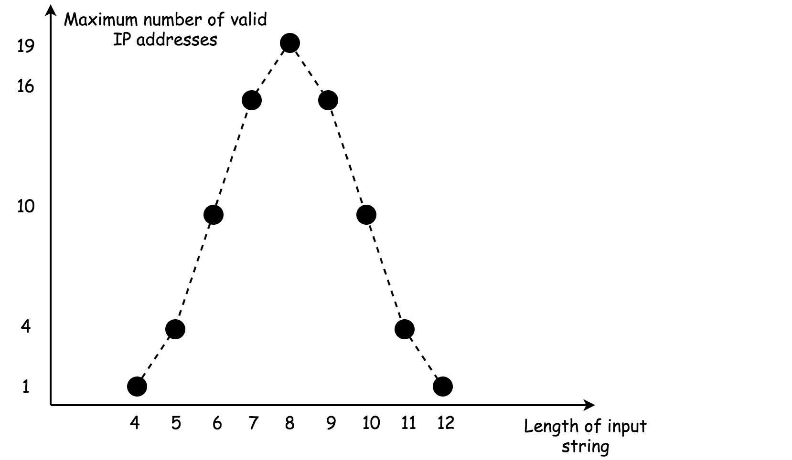

# 93、复原IP地址

给定一个只包含数字的字符串，复原它并返回所有可能的 IP 地址格式。

### 示例:
```
输入: "25525511135"
输出: ["255.255.11.135", "255.255.111.35"]
```
> 链接：https://leetcode-cn.com/problems/restore-ip-addresses
### 复杂度分析
- 时间复杂度 : 如上文所述，需要检查的组合不多于27个。
- 空间复杂度 : 常数空间存储解，不多于19 个有效IP地址。


# 题解
## 1、暴力枚举
```java
class Solution{
    public List<String> restoreIPAddress(String s){
        List<String> res = new ArrayList<>();
        StringBuilder ip = new StringBuilder<>();

        for (int a = 1;a < 4;a++) {
            for (int b = 1;b < 4;b++) {
                for (int c = 1;c < 4;c++) {
                    for (int d = 1;d < 4;d++) {

                        if (a + b + c + d == s.length()) {
                            int seg1 = Integer.parseInt(s.substring(0,a));
                            if (seg1 > 255) continue;
                            int seg2 = Integer.parseInt(s.substring(a,a+b));
                            if (seg2 > 255) continue;
                            int seg3 = Integer.parseInt(s.substring(a+b,a+b+c));
                            if (seg3 > 255) continue;
                            int seg4 = Integer.parseInt(s.substring(a+b+c,a+b+c+d));
                            if (seg4 > 255) continue;
                            ip.append(seg1).append(".").append(seg2).append(".").append(seg3).append(".").append(seg4);
                            if (ip.length() == s.length() + 3) {
                                res.add(ip.toString());
                            }
                            ip.delete(0,ip.length());
                        }
                    }
                }
            }
        }
        return res;
    }
}
```
## 2、深度优先搜索
画出搜索树，理清剪枝条件，写dfs代码
```java
class Solution{
    int n;
    String s;
    List<String> res = new ArratList<>();
    public List<String> restoreIPAddress(String s){
        n = s.length();
        this.s = s;
        dfs(0,4,"");
    }

    private void dfs(int index,int segment,String currIP) {
        // 超过四个字节
        if (segment < 0) return;
        // 处理了四个字节
        if(segment == 0){
            // 是一个有效解
            if(currIP.length() == n + 3) {
                // System.out.println("currIP: " + currIP);
                // 加入结果集
                res.add(currIP);
                return;
            }
        }
        // 处理一个结点
        for (int i = 1;i < 4;i++) {
            // 剩余足够的字符数, 且 剩余字节太长 或者 剩余字节太短
            if (n - index >= i && !(n - index > segment*3 || n - index < segment)) {
                int seg = Integer.parseInt(s.substring(index,index+i));
                if (seg <= 255) {
                    // 添加 .
                    String tmp = null;
                    if (segment != 1) {
                        tmp = "" + seg + ".";
                    } else {
                        tmp = "" + seg;
                    }
                    // System.out.println(currIP + tmp);
                    // 深度优先搜索
                    dfs(index + i,segment-1,currIP + tmp);
                }
            }
        }
    }
}
```