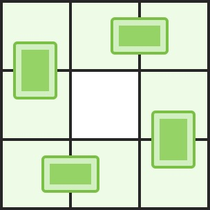

### LCP4、覆盖
你有一块棋盘，棋盘上有一些格子已经坏掉了。你还有无穷块大小为1 * 2的多米诺骨牌，你想把这些骨牌不重叠地覆盖在完好的格子上，请找出你最多能在棋盘上放多少块骨牌？这些骨牌可以横着或者竖着放。


输入：n, m代表棋盘的大小；broken是一个b * 2的二维数组，其中每个元素代表棋盘上每一个坏掉的格子的位置。

输出：一个整数，代表最多能在棋盘上放的骨牌数。

 

#### 示例 1：
```
输入：n = 2, m = 3, broken = [[1, 0], [1, 1]]
输出：2
解释：我们最多可以放两块骨牌：[[0, 0], [0, 1]]以及[[0, 2], [1, 2]]。（见下图）
```


#### 示例 2：
```
输入：n = 3, m = 3, broken = []
输出：4
解释：下图是其中一种可行的摆放方式

```

#### 限制：
```
1 <= n <= 8
1 <= m <= 8
0 <= b <= n * m
```

### 代码
```C++
// mat二分匹配图 from起始点
int mat[105][105], from[105], nn, mm;
bool vis[105];// 访问记录
bool unvisible[10][10];// 不可到达的地点
int match(int x){
    for (int i = 0; i < nn * mm; ++i){
        int dx = i / mm, dy = i % mm;
        if ((dx + dy) & 1) continue;// 黑色位置，跳过
        if (unvisible[dx][dy]) continue;// 不可到达
        if (!mat[x][i]) continue;// 已匹配
        if (!vis[i]){// 未访问
            vis[i] = true;
            if (from[i] < 0 || match(from[i])){// 递归匹配
                from[i] = x;
                return 1;
            }
        }
    }
    return 0;
}
int Hungary(){
    // 认为 (x 坐标 + y 坐标) 为奇数时格子是黑色，对黑色格子找匹配
    int match_size = 0;
    memset(from, -1, sizeof(from));
    for (int i = 0; i < nn * mm; ++i){
        int dx = i / mm, dy = i % mm;
        if (!((dx + dy) & 1)) continue;// 白色跳过
        if (unvisible[dx][dy]) continue;// 不可到达跳过
        memset(vis, 0, sizeof(vis));// 重置访问集合
        match_size += match(i);// 统计匹配集大大小
    }
    return match_size;
}
class Solution {
public:
    int domino(int n, int m, vector<vector<int>>& broken) {
        nn = n, mm = m;
        memset(unvisible, 0, sizeof(unvisible));
        // 初始化不可到达位置
        for (vector<int>& p: broken)
            unvisible[p[0]][p[1]] = true;
        // 初始化邻接矩阵
        memset(mat, 0, sizeof(mat));
        // 初始化匹配
        for (int i = 0; i < n; ++i){
            for (int j = 0; j < m; ++j){
                if (unvisible[i][j]) continue;
                int id = i * m + j;     // 将节点按照 (x 坐标 * m) + (y 坐标) 编号
                // 右边的格子
                if (j + 1 < m && unvisible[i][j + 1] == false){
                    int iid = i * m + j + 1;
                    mat[id][iid] = mat[iid][id] = 1;// 连接两个位置
                }
                // 下面的格子
                if (i + 1 < n && unvisible[i + 1][j] == false){
                    int iid = (i + 1) * m + j;
                    mat[id][iid] = mat[iid][id] = 1;// 连接两个位置
                }
            }
        }
        return Hungary();
    }
};

// 作者：zqy1018
// 链接：https://leetcode-cn.com/problems/broken-board-dominoes/solution/c-er-fen-tu-zui-da-pi-pei-by-zqy1018/
// 来源：力扣（LeetCode）
// 著作权归作者所有。商业转载请联系作者获得授权，非商业转载请注明出处。
```