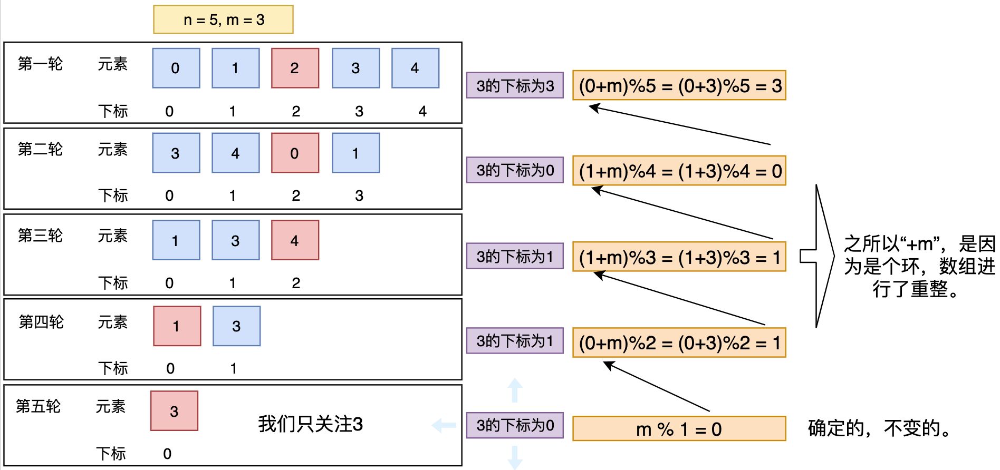

## 题目描述
每年六一儿童节,牛客都会准备一些小礼物去看望孤儿院的小朋友,今年亦是如此。HF作为牛客的资深元老,自然也准备了一些小游戏。其中,有个游戏是这样的:首先,让小朋友们围成一个大圈。然后,他随机指定一个数m,让编号为0的小朋友开始报数。每次喊到m-1的那个小朋友要出列唱首歌,然后可以在礼品箱中任意的挑选礼物,并且不再回到圈中,从他的下一个小朋友开始,继续0...m-1报数....这样下去....直到剩下最后一个小朋友,可以不用表演,并且拿到牛客名贵的“名侦探柯南”典藏版(名额有限哦!!^_^)。请你试着想下,哪个小朋友会得到这份礼品呢？(注：小朋友的编号是从0到n-1)

# 题解

## 问题的迭代过程
- 第一步：一个长度为n的数组，下标范围`0~n-1`。
- 第二步：现在要对该数组的第m个元素进行删除，即第`m%n`个元素。
- 第三步：**重整数组**，重复第一、二步，直到数组只剩下一个元素。

## 求什么：
- **最后剩下的元素是原数组的哪一个？即最后的元素在原数组中的位置**
## 怎么求？
- 我们知道最后剩下的元素在**当前数组**的位置是0，因为只有一个元素了呀。
- 从这个下标0出发，找到下标0在之前的每一次变换后数组的下标.
- 正向迭代：$f_i$ 表示第i次迭代，删除元素的在当前数组中的下标。我们来看一下正向的迭代过程:
$$
f_1 = m \% n，\\
f_2 = m \% (n-1)\\
... \\
f_n = m \% 1 = 0\\
即：f_i = m \% i, i = 1...n
$$
- 显然，上述过程存在一个数组重整（删除第 m 个元素）的过程,即我们的循环队列解法。那么 $f_i$ 和 $f_{i-1}$ 有什么递推关系呢?
- 那就要从这个重整元素开始说起：
    - 在每一次删除元素后，数组的下表进行了重整，即：



- 从上图中可以很方便的总结递推关系。即下面：
- 很多题解解释了递推关系的由来，也给出了递推关系：
$$
f_{i-1} = (f_i + m) \% (n - i + 2), i = n...2, f_n = 0
$$
- 为了方便使用迭代法，当然也可以写成：
$$
g_j = (g_{j-1} + m) \% j, j = 2...n, g_1 = 0
$$

## 那么这道题的本质是什么呢？
**其实就是下标的逆变换！！！将最后一个被删除的元素在数组中的下表逆变换到在原始数组中的下标！！！**
## 可能很多人太关注正向求解了，因此对于这道题的数学答案很迷惑，其实每个人都是这样走过来的。不妨逆向思维思考一下，题目一下子就变了。
- 正向求解：这一轮我们删除那个元素呢？删除到最后，剩下的最后一个即为答案。
- 逆向求解：最后一个被删除元素的下表一定是0 `(m%1=0)`，那么在上一轮数组中的下表是什么呢？`(0+m)%2`
## 这种逆向思维就是递归中我们看不见的递归返回，很多动态规划其实也是这样的。
## 1、数学 + 递归
```cpp
class Solution {
public:
    // 约瑟夫环，可基于队列求解
    // 也可通过数学公式倒推
    int LastRemaining_Solution(int n, int m)
    {
        if(n==0)
            return -1;
        if(n==1)
            return 0;
        else {
            // 递推
            return (LastRemaining_Solution(n-1,m)+m)%n;
        }
            
    }
};
```
- JAVA 版
```java
class Solution {
    public int lastRemaining(int n, int m) {
        // 元素个数1个
        return f(n,m);
    }
    private int f(int n,int m) {
        if (n == 1) {
            return 0;
        }
        int x = f(n-1,m);
        return (x + m) % n;
    }
}
```
## 2、数学 + 迭代
最后一个去除的数组的下表
```Java
class Solution {
    public int lastRemaining(int n, int m) {
        int f = 0;
        for (int i = 2;i != n+1;i++) {
            f = (f + m) % i;
        }
        return f;
    }
```
